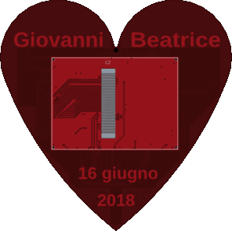

# Arduino Heart

This project is born as gift to Giovanni and Beatrice marriage.

The aesthetical design is built around an heart with in front a color display with touch, two capacitive sensors on Giovanni and Beatrice names and the marriage date. On the back can be found an Arduino Due board as main controller, an esp8266 as wifi client (via SPI), an SD card, an RTC chip and a buzzer. All hardware information, with schematics and rendering, can be found on the `hardware` folder. Main source code can be found on `src` and `include`; `lib` contains all external libraries fetched with `git submodule`; `external` contains the esp8266 firmware used as wifi client over SPI.



# Features

- wifi client with WPA2 support
- rtc timer with alarm and clock
- ntp time syncronization
- sd card with FAT/FAT32
- color display and touch screen
- capacitive sensors
- jpeg/raw image rendering

# Build

Clone the main repository with the following command

```bash
git clone --recurse-submodules -j8  [repository]
```

then you can use _platformIO_, through emacs/terminal o Visual Studio Code, to build and upload the code to the arduino board through the usb programm port. Probably can be easy to write a cmake configuration file and avoid platformIO seen that the only external requirement is the Arduino framework for the _atmelsam_ platform.

Main configuration parameters live at `include/config.h` where you can find many _define_ to enable debugging to serial console and enable/disable functions.

# Todo

- use interrupt or timer to manage changes on display, like slideshow photo change or "marriage from" clean
- multiple udp/tcp socket like, ntp and webserver at the same time
- sleep mode with wake up
- memory usage optimization
- probably a clean up/unification on class management

# Thanks to

- Arduino/ESP8266 projects and all examples found on Internet
- Jiri Bilek for [WiFiSpi](https://github.com/JiriBilek/WiFiSpi) and [WiFiSpiESP](https://github.com/JiriBilek/WiFiSpiESP)
- Henning Karlsen for [UTFT](http://rinkydinkelectronics.com/library.php?id=51), [URTouch](http://rinkydinkelectronics.com/library.php?id=92) and [DS1307](http://rinkydinkelectronics.com/library.php?id=34)
- SAM scheduler [repository](https://github.com/arduino-libraries/Scheduler)
- Arduino SD library [site](http://www.arduino.cc/en/Reference/SD)
- Paul Stoffregen for [TimeAlarms](https://github.com/PaulStoffregen/TimeAlarms)
- Jack Christensen for [Timezone](https://github.com/JChristensen/Timezone)
- Bodmer for [JPEGDecoder](https://github.com/Bodmer/JPEGDecoder)
- Graham Lawrence for the [UTFT_SdRaw](https://github.com/ghlawrence2000/UTFT_SdRaw) code
